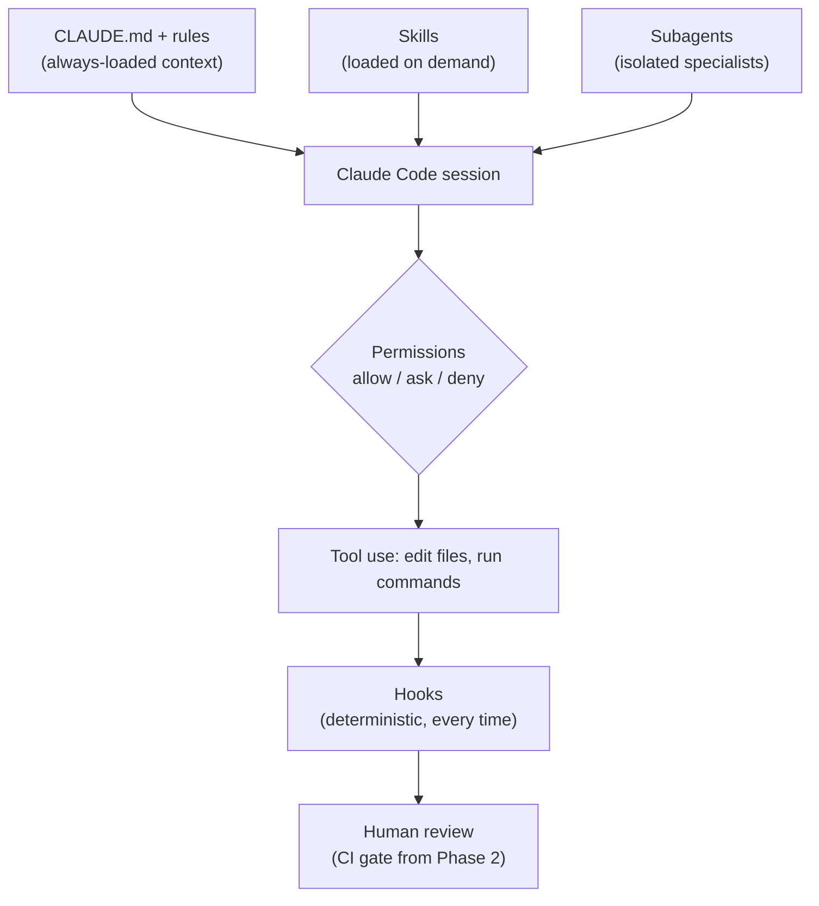

# AI Development Workflow

This project is developed with [Claude Code](https://docs.claude.com/en/docs/claude-code/overview) as a coding assistant. This document explains how the AI environment is configured, what the AI is and isn't allowed to do, and why.

The short version: **the AI writes application code under guardrails, I write all platform and DevOps code myself, and the AI reviews it.**

## Ownership model

The goal of this repository is to demonstrate container-based delivery skills, so responsibilities are split deliberately.

| Area | Author | AI role |
|---|---|---|
| Application code (`app/`) and its tests | Claude Code, under review | Writes, tests, self-reviews |
| Documentation (ADRs, runtime contract, release notes) | Shared | Drafts, I edit |
| Dockerfiles, compose files, Makefile | Me | Reviews only |
| CI/CD workflows (`.github/workflows/`) | Me | Reviews only |
| Terraform, Ansible, Traefik, monitoring | Me | Reviews only |

The interface between the two halves is [`docs/app-runtime.md`](app-runtime.md): the application documents the contract a container must satisfy (start command, migration command, port, environment variables, health endpoints, build-time values), and the platform is built against that contract. This mirrors how application and platform teams typically collaborate.

## Layers of control

Claude Code offers several mechanisms for steering an agent. They differ in when they apply and how strictly, so each is used for a different purpose.



Instructions guide behavior; permissions and hooks enforce it. The highest-risk actions are enforced, not just requested.

## Directory layout

```
CLAUDE.md                        # Project context, loaded every session
app/CLAUDE.md                    # App conventions, loaded when working in app/
infra/terraform/CLAUDE.md        # Terraform rules, loaded when working in infra/
.claude/
├── settings.json                # Permissions and hooks (committed)
├── rules/
│   ├── security.md
│   └── devops-ownership.md
├── agents/
│   ├── code-reviewer.md
│   └── devops-reviewer.md
├── commands/
│   └── verify.md
└── skills/
    ├── add-endpoint/            # SKILL.md + test template
    ├── db-migration/
    ├── write-adr/               # SKILL.md + ADR template
    ├── release-notes/
    └── ansible-role/            # Manual-only review checklist
```

Personal overrides (`CLAUDE.local.md`, `.claude/settings.local.json`) are gitignored, so the committed configuration is the shared project baseline.

## Context: CLAUDE.md files and rules

The root `CLAUDE.md` is kept short because it is loaded into every session. It covers what the project is, the stack, core conventions (all config via environment variables, every endpoint tested, every schema change migrated, one image for every environment), and the ownership boundaries above.

Directory-scoped `CLAUDE.md` files load only when the agent works in that directory, so app conventions don't consume context during unrelated work and vice versa. `app/CLAUDE.md` covers code structure, configuration (settings only through `config.py`), and metric labeling; `infra/terraform/CLAUDE.md` states that Terraform is plan-only.

Files in `.claude/rules/` hold rules that must survive regardless of how `CLAUDE.md` evolves: `security.md` (no hardcoded secrets, no reading or modifying `.env` or vault files, no commands that change remote infrastructure, non-root containers with pinned base images) and `devops-ownership.md` (the AI does not create or modify platform files, including `.claude/settings.json`, unless explicitly asked in the current message).

## Enforcement: permissions

`.claude/settings.json` defines three tiers.

**Allow** covers safe, frequent commands so the agent isn't interrupted constantly: `make`, `pytest`, and `uv` (the package manager, which also runs the linters, type checker, and tests).

**Ask** covers file edits in every DevOps path: `docker/`, `deploy/`, `infra/`, `ansible/`, `monitoring/`, `.github/workflows/`, and the `Makefile`. The agent must request approval before editing these with its file tools, so it can help when I explicitly want it to. This is the technical backstop for the ownership model. It matches file edits only, not shell commands that write files; the ownership rules and my review of every diff cover that gap.

**Deny** covers secrets, pushes, infrastructure changes, and all container commands:

- reading `./.env` and any `vault.yml`
- `terraform apply` and `terraform destroy`
- `ansible-playbook`
- `git push`
- `docker` (which includes `docker compose` and `docker push`), `docker compose`, `podman`, and `podman-compose`

Container commands are denied rather than asked: I run containers myself, so the agent never builds, runs, or pushes images. Pushing code is always mine. Deployments will run only through CI pipelines, which arrive in Phase 2.

## Automation: hooks

A `PostToolUse` hook runs `ruff format` and `ruff check --fix` on the app after every file edit. Unlike instructions, hooks run every time, so formatting is never left to the model's memory and diffs stay clean. The hook is non-blocking (`|| true`): anything it cannot fix is left for `/verify` to report.

## Specialists: subagents

Subagents run in their own context window with a restricted tool set.

**`code-reviewer`** reviews the current diff for correctness, missing tests or migrations, misplaced configuration, secrets in code, and convention violations. It reports findings by severity. It has `Bash` so it can run the checks, so "does not edit files" is an instruction rather than a technical limit. It is run at the end of every feature before commits are proposed.

**`devops-reviewer`** reviews the platform code I write: Dockerfiles, compose files, workflows, Terraform, and Ansible. It has only read tools (`Read`, `Grep`, `Glob`), so it physically cannot modify files. It is instructed to act as a mentor: for each finding it gives severity, location, the problem, why it matters, and a hint toward the fix rather than the full solution, so the learning stays with me.

## Playbooks: skills

Skills are loaded only when a task matches their description, or when invoked with `/skill-name`, which keeps detailed procedures out of the always-loaded context.

| Skill | Purpose | Invocation |
|---|---|---|
| `add-endpoint` | Consistent route, schema, service, test, and docs for every endpoint. Ships a test template. | Automatic |
| `db-migration` | Enforces expand/contract migrations (see below). | Automatic |
| `write-adr` | Architecture decision records from a bundled template, with honest alternatives. | Automatic |
| `release-notes` | Groups conventional commits into release notes; never creates tags or releases itself. | Automatic |
| `ansible-role` | Review checklist for roles I write. | Manual only (`disable-model-invocation`) |

### Why `db-migration` matters

Canary releases run the old and new application versions **at the same time against the same database**. A migration that drops or renames a column breaks whichever version doesn't expect it. The skill therefore restricts each release to backward-compatible changes and splits destructive changes across releases using the expand/contract pattern, and it requires every migration to be proven reversible (upgrade, downgrade, upgrade) before review.

## Development loop

1. **Branch.** Work happens on feature branches that are merged into `main`. Pull requests with required status checks start once CI exists in Phase 2.
2. **Plan.** Larger tasks start in plan mode: the agent proposes a plan and file list, and nothing is written until I approve it.
3. **Implement in small steps.** After each step the agent runs `/verify` (linting, type checks, unit tests, and integration tests when `TEST_DATABASE_URL` is set) and fixes failures before continuing.
4. **Self-review.** The `code-reviewer` subagent reviews the diff; findings are summarized and addressed.
5. **Human review.** I review every diff. Commits use conventional commits; I make them, or the agent does when I explicitly ask. Pushing is always mine (`git push` is denied).
6. **CI as the final gate (Phase 2).** Once GitHub Actions exists, every pull request will have to pass the same checks as `/verify`, regardless of who or what wrote the code. Until then, `/verify` and my review are the gate.

For platform work the loop is reversed: I write the code, run the `devops-reviewer` subagent, and decide which findings to act on.

## Design principles

- **Enforce, don't just instruct.** The highest-risk actions (reading secrets, pushing, applying infrastructure, running containers) are blocked by permissions, not left to a prompt.
- **Least privilege.** The DevOps reviewer gets read-only tools; the agent cannot push code, run containers, or apply infrastructure changes.
- **Keep always-on context small.** Detailed procedures live in skills and scoped `CLAUDE.md` files.
- **Same gates for everyone.** AI-written and human-written code pass the same checks: `/verify` today, CI from Phase 2.
- **Transparency.** This document exists so anyone reading the repository knows how AI was used and where its boundaries were.
